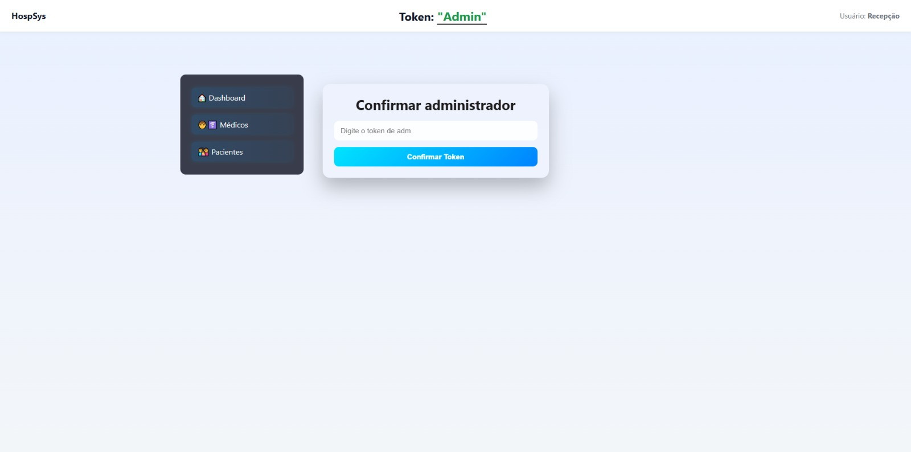
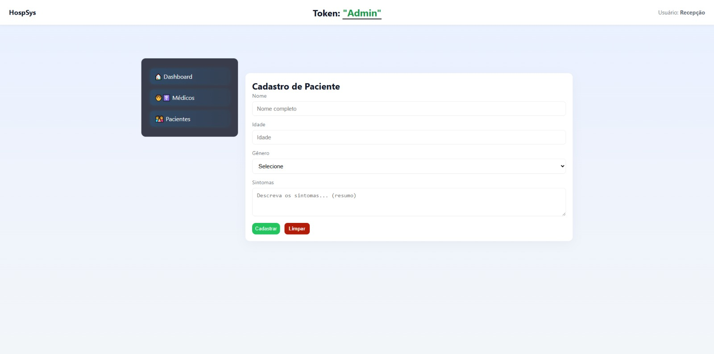
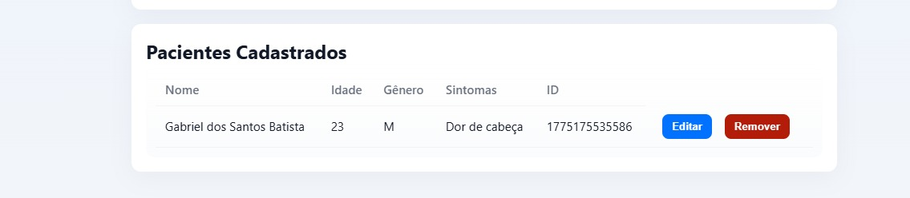
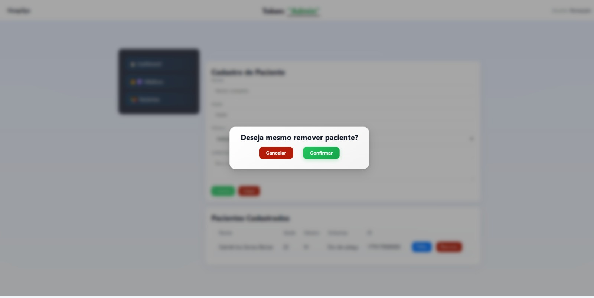
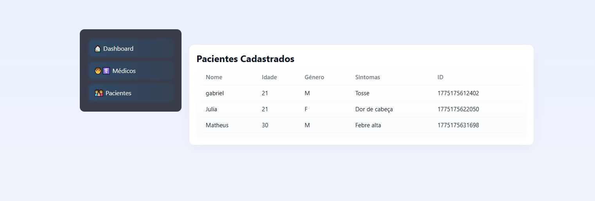
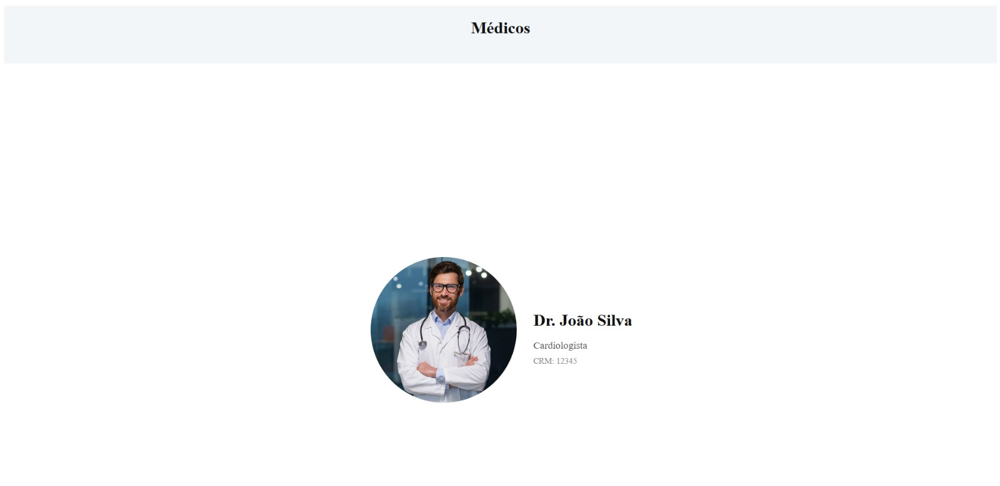

# 🏥 CRUD de Pacientes

  


Uma aplicação web que simula um **sistema de cadastro de pacientes**, com controle de acesso, validações e operações completas de CRUD.

---

## 🌍 Sobre o projeto

Este projeto representa um sistema simples de gerenciamento de pacientes, onde o usuário precisa passar por um **controle de acesso via token** antes de interagir com a aplicação.

O sistema foi desenvolvido com foco em **lógica de programação, manipulação de DOM e controle de fluxo entre telas**, simulando um ambiente próximo de aplicações reais.

---

## 🖼️ Preview

<div align="center">
  
  
</div>

<div align="center">
  
  

  <div align="center">
  
  
</div>

---

## 🚀 Funcionalidades

✔️ Controle de acesso por token  
✔️ Validação de formulário completa  
✔️ Cadastro de pacientes  
✔️ Listagem dinâmica de pacientes  
✔️ Edição de dados em tempo real  
✔️ Remoção de pacientes  
✔️ Área separada para médicos  
✔️ Navegação entre telas  

---

## 🔐 Controle de acesso

- Sistema exige um **token válido** para liberar o acesso  
- Validação de entrada do usuário  
- Exibição condicional do sistema após autenticação  

---

## 👤 Gestão de pacientes

- Cadastro com validações:
  - Nome  
  - Idade  
  - Gênero  
  - Sintomas  

- Listagem com verificação automática (estado vazio)  
- Edição com campos preenchidos automaticamente  
- Remoção com atualização imediata da interface  

---

## 🧑‍⚕️ Área de médicos

- Seção separada dentro do sistema  
- Exibição de informações adicionais  
- Simulação de ambiente mais completo  

---

## 🛠️ Tecnologias utilizadas

- HTML5  
- CSS3  
- JavaScript (Vanilla JS)  

---

## 🎯 Objetivo do projeto

- Praticar CRUD completo  
- Trabalhar validação de dados  
- Manipular o DOM de forma dinâmica  
- Controlar estados da interface  
- Simular um sistema real com regras de acesso  

---

## 🌐 Deploy

Acesse o projeto online:  
👉 https://sistema-hospital-nu.vercel.app/

## ▶️ Como rodar o projeto

```bash
# Clone o repositório
git clone https://github.com/gabrieldev25789/crud-pacientes.git

# Acesse a pasta
cd crud-pacientes

# Abra no navegador
index.html